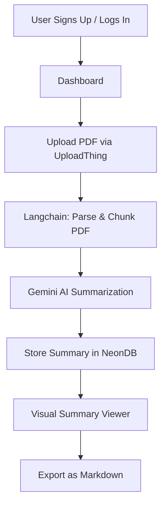

<div align="center">

<br />


<br /><br />

# 📄✨ Sommaire

### Transform your PDFs into beautiful, Instagram Reel-style visual summaries — powered by AI.

<p align="center">
  <strong>🚀 Built with Next.js 16 · React 19 · GPT-4 · Langchain · NeonDB · Stripe · Clerk</strong>
</p>

<br />

[🌐 Live Demo](https://sommaire-ai-delta.vercel.app/)

<br />

</div>

## 📸 Preview

---

## 🌟 Features

| Feature                    | Description                                                            |
| -------------------------- | ---------------------------------------------------------------------- |
| 📝 **AI Summaries**        | Clear, structured key points & insights with emoji-enhanced output     |
| 🎨 **Visual Viewer**       | Instagram Reel-style interactive summary viewer with progress tracking |
| 🔒 **Secure Uploads**      | Safe file handling via UploadThing (up to 32MB PDFs)                   |
| 🔐 **Protected Routes**    | Auth-guarded pages and API endpoints with Clerk                        |
| 💰 **Pricing Plans**       | Flexible Basic and Pro subscription tiers via Stripe                   |
| 🪝 **Stripe Webhooks**     | Full webhook implementation for subscription events                    |
| 📊 **User Dashboard**      | Manage, view, and export all your summaries in one place               |
| 📱 **Responsive Design**   | Optimized for mobile and desktop experiences                           |
| 🔄 **Real-time Updates**   | Live path revalidation and state updates                               |
| 🔔 **Toast Notifications** | Upload status, processing updates, and error feedback                  |
| 🗂️ **Markdown Export**     | Download summaries as `.md` files — convert to blog posts              |
| 🔍 **SEO Optimized**       | Summary generation built with discoverability in mind                  |
| 📈 **Performance**         | Server Components, lazy loading, and image optimization                |

---

## 🛠️ Tech Stack

> **$0 Tech Stack — everything used is FREE.**

### 🧠 AI & Processing

| Tool                       | Purpose                                             |
| -------------------------- | --------------------------------------------------- |
| **Gemini AI** _(fallback)_ | Free alternative when OpenAI credits run out        |
| **Langchain**              | PDF parsing, text extraction, and document chunking |

### ⚙️ Core Framework

| Tool                        | Purpose                                                  |
| --------------------------- | -------------------------------------------------------- |
| **Next.js 15** (App Router) | SSR, routing, API endpoints, Server Components & Actions |
| **React 19**                | Interactive UI with reusable components                  |
| **TypeScript 5**            | Static typing and enhanced DX                            |
| **TailwindCSS 4**           | Utility-first responsive styling                         |

### 🔐 Auth & Payments

| Tool       | Purpose                                                 |
| ---------- | ------------------------------------------------------- |
| **Clerk**  | Authentication — Passkeys, GitHub, Google Sign-in       |
| **Stripe** | Subscription management, cancellations, secure payments |

### 🗄️ Database & Storage

| Tool                    | Purpose                                         |
| ----------------------- | ----------------------------------------------- |
| **NeonDB** (PostgreSQL) | Serverless database for summaries and user data |
| **UploadThing**         | Secure PDF upload and file management           |

### 🎨 UI & Deployment

| Tool          | Purpose                                          |
| ------------- | ------------------------------------------------ |
| **ShadcN UI** | Accessible, customizable React component library |
| **Vercel**    | Zero-config production deployment                |

---

## 🚀 Getting Started

### Prerequisites

Make sure you have the following installed:

- **Node.js** `>= 18.x`
- **npm** or **pnpm** (recommended)
- **Git**

### 1. Clone the Repository

```bash
git clone https://github.com/faisal-din/somaire-pdf-summarization-tool.git
cd sommaire
```

### 2. Install Dependencies

```bash
npm install
# or
pnpm install
```

### 3. Configure Environment Variables

Create a `.env.local` file in the root directory:

```env

# ─── Clerk (Authentication) ───────────────────────
NEXT_PUBLIC_CLERK_PUBLISHABLE_KEY=your_clerk_publishable_key
CLERK_SECRET_KEY=your_clerk_secret_key

NEXT_PUBLIC_CLERK_SIGN_IN_URL=/sign-in
NEXT_PUBLIC_CLERK_SIGN_UP_URL=/sign-up

# ─── Gemini AI ──────────────────
GEMINI_API_KEY=your_gemini_api_key

# ─── NeonDB (PostgreSQL) ─────────────────────
NEON_DATABASE_URL=your_neondb_connection_string

# ─── UploadThing ─────────────────────────────
UPLOADTHING_TOKEN=your_uploadthing_token

# ─── Stripe ──────────────────────────────────
STRIPE_SECRET_KEY=your_stripe_secret_key
STRIPE_PUBLISHABLE_KEY=your_stripe_publishable_key
STRIPE_WEBHOOK_SECRET=your_stripe_webhook_secret
STRIPE_BASIC_PLAN_PRICE_ID=your_basic_plan_price_id
STRIPE_PRO_PLAN_PRICE_ID=your_pro_plan_price_id

NODE_ENV=development

```

### 4. Run the Development Server

```bash
npm run dev
# or
pnpm dev
```

Open [http://localhost:3000](http://localhost:3000) in your browser. 🎉

---

## 🎨 Application Flow



---

## 💳 Pricing Plans

| Feature               | 🆓 Basic  | 💎 Pro    |
| --------------------- | --------- | --------- |
| PDFs per month        | 5         | Unlimited |
| Max file size         | 16MB      | 32MB      |
| Markdown export       | ✅        | ✅        |
| Priority processing   | ❌        | ✅        |
| Early access features | ❌        | ✅        |
| Support               | Community | Priority  |

> Payments handled securely by **Stripe**. Cancel anytime.

---

## 🪝 Stripe Webhook Events

The following Stripe events are handled via `/api/webhooks/stripe`:

| Event                           | Action                     |
| ------------------------------- | -------------------------- |
| `checkout.session.completed`    | Activate user subscription |
| `customer.subscription.deleted` | Downgrade to free tier     |

---

## 🧠 AI Summarization Pipeline

```
1. PDF Upload (UploadThing)
         ↓
2. PDF Parsing & Text Extraction (Langchain PDFLoader)
         ↓
3. Document Chunking (RecursiveCharacterTextSplitter)
         ↓
4. Prompt Engineering (Structured summary with emoji)
         ↓
5. LLM Call → GPT-4o or Gemini AI (fallback)
         ↓
6. Markdown Summary Stored in NeonDB
         ↓
7. Visual Reel-style Rendering in Browser
```

---

## 📄 License

Distributed under the **MIT License**. See [`LICENSE`](LICENSE) for more information.

---

## 🙌 Acknowledgements

- [Next.js](https://nextjs.org/) — The React framework for production
- [Clerk](https://clerk.dev/) — Authentication made simple
- [Langchain](https://js.langchain.com/) — LLM orchestration framework
- [NeonDB](https://neon.tech/) — Serverless Postgres
- [UploadThing](https://uploadthing.com/) — Painless file uploads
- [Stripe](https://stripe.com/) — Payments infrastructure
- [ShadcN UI](https://ui.shadcn.com/) — Beautiful component library
- [Vercel](https://vercel.com/) — Frontend cloud platform

---

<div align="center">

**Built with ❤️ and a lot of ☕**

If this project helped you, please consider giving it a ⭐ on GitHub!

<br />

[](https://github.com/faisal-din/sommaire)

<!-- [](https://twitter.com/yourusername) -->

</div>
